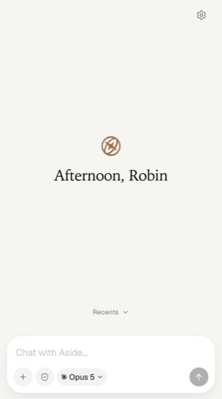
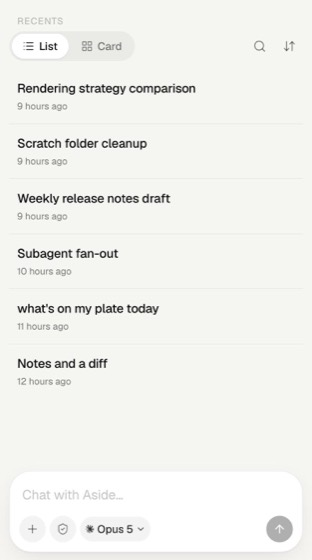
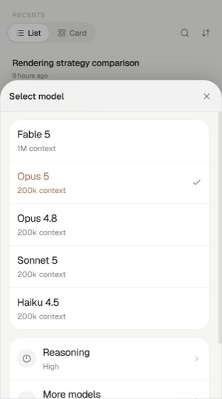

# aside-telegram-bridge

Text your [Aside](https://aside.so) browser agent from your phone.

Your full Aside agent -- tools, memory, everything -- living in a Telegram
chat. Ask it things, send it photos, give it multi-step tasks, watch live
progress fold into a tidy collapsible worklog when it's done.

## Install (one command)

Open Terminal and paste:

```bash
curl -fsSL https://raw.githubusercontent.com/SaiAmartya/aside-telegram-bridge/main/install.sh | bash
```

The setup wizard walks you through the rest:

1. It asks for a bot token -- message [@BotFather](https://t.me/botfather)
   in Telegram, send `/newbot`, copy the token it gives you.
2. You text your new bot once -- the wizard detects you automatically.
3. Pick a reply style. The chat bridge installs itself as a background
   service and your bot answers from then on, even after reboots.
4. It then offers the Mini App and defaults to yes. That step builds the
   web app, so it takes a few minutes on a first run; the chat bridge is
   already working while it does. It finishes by printing your public
   URL and pointing your bot's menu button at it.

Budget about two minutes of your attention and a few more of waiting.
Everything after the token is either automatic or a yes/no.

No dependencies, no pip installs, no webhooks, no ports. Plain Python that
ships with macOS, talking outbound to Telegram only.

Requirements: a Mac with [Aside](https://aside.so) installed, and a
Telegram account. The [Mini App](#the-mini-app) also needs Node 20+ --
the installer checks for it up front and tells you how to add it later if
it is missing, rather than failing halfway.

Nothing needs configuring by hand. The wizard finds which Aside account
you are signed in to (`~/.aside/accounts.json`), writes the matching
session, credential and database paths, and deliberately pins no model:
the Mini App reads your desktop app's own default and full provider list
live, so the phone always shows what the browser shows.

## What it feels like

```
you:   what's on my plate today
aside: Three things: the 7pm walkthrough with Josh, SAT prep at
       9:30, and that email from Vercel you've been ignoring.

you:   handle the email
aside: On it.
       ⏳ working · 45s · 3 steps      <- one live status line
aside: Drafted a reply. Want to see it before I send?
```

- Replies come as short chat bubbles, plain text, no markdown walls.
- Long tasks: one ack, one live status line (elapsed time + current step),
  then the result. When it finishes, the status line collapses into a
  tap-to-expand worklog of everything it did.
- Subagents get their own live roster inside that status line: each
  spawned subagent shows as a row (running/done/failed, elapsed time,
  and a one-line snippet of its result once it finishes), so parallel
  or background research doesn't just disappear into a generic
  "subagent_wait" tool call. The full history (spawn -> wait -> result
  per subagent) is preserved in the tap-to-expand worklog too.
- Send a photo and the agent opens and looks at it.
- Messages sent mid-task queue politely and run next.
- Decisions come back as buttons. An action with side effects asks for
  Approve/Deny; a real choice comes as a question with one button per
  option. The agent is told never to use Aside's native question tools,
  which park a session on a prompt only your computer can answer — see
  [docs/NATIVE-QUESTIONS.md](docs/NATIVE-QUESTIONS.md).

## Chat commands

| command | what it does |
|---|---|
| `/status` | model, session, busy/idle, queue (instant, even mid-task) |
| `/model sonnet\|fable\|opus` | switch model |
| `/effort` | pick thinking effort for the next message (inline buttons: off, minimal, low, medium, high, xhigh, ultrabrowse -- same levels as the aside browser) |
| `/effort <level>` | set it directly without the button menu |
| `/usage` | Claude subscription usage + context-window fill + cost |
| `/new` | fresh persona-primed session (full access, native confirm off) |
| `/sessions` | list recent Aside sessions, tap a button to switch into one |

## The Mini App

The chat is for texting your agent. The Mini App is for *watching* it work:
the full Aside UI, inside Telegram, on the phone you already have out.

https://github.com/user-attachments/assets/d119cb77-8860-463e-87b5-88b98212fc29

| Home | Recents | Model &amp; reasoning |
|:---:|:---:|:---:|
|  |  |  |

<sub>Captured from a fixture install: the name, the session titles and the
provider list above are all invented test data, not anyone's real
sessions.</sub>

Opening the app lands on a quiet screen: the mark, a greeting and the
composer. Your history is one swipe below, scrolling up from under the
composer. The composer itself does not change when you send -- the thread is
the same screen with the conversation in it.

Tap the **Aside** button next to the message box and you get:

- **Sessions** -- every Aside session on your Mac, including the ones
  started from the desktop app, with unread dots and live status.
- **Live transcripts** -- tool calls stream in as they happen, then fold
  into one `Worked for 7m 43s ›` row the moment the answer starts. Tap to
  reopen the whole timeline.
- **Subagents** -- each spawn gets a coloured creature and its own nested
  card with the model it's on, its brief, and its tool timeline ticking
  over live. Tap through to the child's own thread.
- **Task list** -- the todos the agent keeps for itself, collapsed above
  the composer and in the session panel.
- **Questions and approvals** -- when the agent needs a decision it comes
  through as a card with tappable options, not a wall of JSON. Sessions
  started from your phone (in the Mini App *or* by texting the bot) are
  instructed never to use Aside's native question tools, which suspend a
  session on a prompt only your computer can answer; and if one turns up
  anyway -- from a session started on the desktop, say -- the card offers
  **Continue in a new session**, seeded with the question and the option
  you tap. See [docs/NATIVE-QUESTIONS.md](docs/NATIVE-QUESTIONS.md).
- **Stop** -- kill a running turn from the composer.
- **Citations, files, attachments** -- `[1]` chips open their source;
  what the agent wrote and what you sent render in a side panel; photos
  picked from the phone land on disk and the agent opens them.
- **Control** -- model, reasoning effort and permission pickers writing to
  the same daemon state the desktop app reads, plus a settings screen for
  what new sessions should default to.

Setup is one prompt at the end of the wizard, or run it later:

```bash
python3 miniapp/setup-miniapp.py
```

It checks for Node 20+, builds the app, installs a launchd service
(`com.aside.miniapp`), starts a Cloudflare quick tunnel so Telegram can
reach it over HTTPS, and points the bot's menu button at it -- that button
is the **Aside** entry you tap. Quick-tunnel URLs rotate on restart and the
server re-registers the button each time, so it keeps working.

**How auth works.** Telegram signs every Mini App launch with an HMAC over
your bot token; the server validates that signature, checks the user id
against the same one-person allowlist the bridge uses, and mints a 24-hour
JWT. Every API call and the WebSocket carry it. Nothing is exposed but that
one authenticated HTTP surface, bound to loopback and published through the
tunnel — no inbound ports, no database, no third-party service. The bot
token never leaves the process, and the tunnel binary is a pinned
cloudflared release verified against a SHA-256 vendored in this repo before
it is ever executed.

**[docs/MINIAPP.md](docs/MINIAPP.md)** has the architecture, the full setup
path, the config keys, and the limitations worth reading before deciding
something is broken — chiefly: a question the agent raises with its native
tools can only be answered from your computer (both surfaces now work hard
to stop one ever being raised, and offer a way onward when one is —
[docs/NATIVE-QUESTIONS.md](docs/NATIVE-QUESTIONS.md)), and you can stop a
turn but not steer one.

## Managing it

Setup links a `bridgemon` command into `~/bin`. It manages both services:

- `bridgemon status` -- bridge and Mini App together: running state, pid,
  port, tunnel URL, last error, last log lines.
- `bridgemon watch` -- live timeline of everything the bridge and agent do,
  plus a one-key kill switch.
- `bridgemon update` -- pull the latest version, syntax-check, restart, and
  auto-rollback if anything looks broken. When the Mini App is installed it
  is rebuilt (`npm install && npm run build`) and restarted too, with the
  same snapshot-and-roll-back rule.
- `bridgemon miniapp start|stop|restart|logs` -- the Mini App on its own.
- `bridgemon logs` / `rollback` / `init` -- the rest.

To stop everything: `bridgemon watch --kill` and `bridgemon miniapp stop`.

## Security, the short version

- Your bot token is a credential. `config.json` is chmod 600 and gitignored.
- Hard allowlist: the bridge ignores every Telegram chat except yours.
  Strangers get silence.
- Bridge sessions run with full tool access so the agent can actually do
  things unattended -- understand what that means on your machine. Switch
  the grant to `guard` in `bridge.py` if you want confirmation-gated
  behavior.
- Kill switch always works, and messages sent while the bridge is down are
  recovered on restart.

<details>
<summary><b>Architecture</b> (for the curious)</summary>

```
Telegram  <--long poll-->  bridge.py (launchd daemon)  <--aside CLI-->  Aside agent
                            |  poller thread: getUpdates, commands, photos
                            |  worker thread: one turn at a time, batching
                            |  TurnStream: ack / status-fold / final routing
                            +--reads replies from the session's messages.jsonl
```

Three layers:

1. **Bridge daemon** (`bridge.py`): long-polls the Telegram Bot API
   (outbound only), shells out to the `aside` CLI, reads replies from the
   session transcript, streams them back as bubbles.
2. **Persona layer**: a persistent Aside session primed with a texting-mode
   persona (auto-created on first run, re-created via `/new`). Full agent,
   adapted voice.
3. **Proactive layer** (optional): an Aside routine that pushes a morning
   digest or alerts into the same chat via the Bot API. Prompt sketch: pull
   calendar + important unread email, read token/chat_id from
   `config.json`, POST 2-4 short plain-text messages to `sendMessage`,
   never print the token.

The reply source of truth is the session's `messages.jsonl`, not CLI
stdout, which stays clean when turns involve tool calls and thinking.

</details>

<details>
<summary><b>Status folding</b> (how the worklog collapse works)</summary>

Telegram can't collapse "thought for 4 mins" like a native UI, so the
bridge approximates it: narration and tool-call titles go into one
notification-silent message edited in place (elapsed timer + step count +
latest note). When the turn ends, that message is edited into a collapsed
`<blockquote expandable>` containing the full timestamped worklog -- tap
to expand, ignore otherwise. Chat history keeps: ack → questions/blockers
→ folded worklog → result. Anything that genuinely needs you (a decision,
an approval, a blocker) escapes the fold and pings for real.

</details>

<details>
<summary><b>Design limits</b> (read before filing issues)</summary>

- **A session parked on a native question tool cannot be revived.** Not
  from chat, not from the Mini App, not by any CLI or repl path — the
  daemon waits for the desktop sidepanel and nothing else. Both surfaces
  therefore work to stop one ever being raised: every session they start
  carries an instruction against those tools, every follow-up carries a
  one-line reminder, and the daemon's final-confirm flag (which *mandates*
  the fatal tool) is explicitly turned off on sessions they create. The one
  turn still exposed is a new session's first, because runtime config only
  binds on the next spawn. [docs/NATIVE-QUESTIONS.md](docs/NATIVE-QUESTIONS.md)
  has the detail.
- **No mid-turn steering.** Messages sent while the agent is working queue
  and run as the next turn; they never redirect the current one. We tested
  every path to real steering: the `aside` CLI silently drops prompts sent
  to a busy session, and Aside's daemon contains a full native Telegram
  channel system with a real steering queue -- but its delivery path
  doesn't call `steer()` yet and drops mid-turn messages. Until that
  ships, queueing is the honest behavior. (We ran the native system in
  production for an evening and reverted.) You *can* stop a running turn
  from the Mini App's composer — the server kills the `aside exec` child it
  owns — but stopping is not steering.
- **Serial by design.** One turn at a time; adjacent messages batch.
- **macOS only** as written (launchd, Aside's file layout). The Telegram
  and transcript logic is portable if someone wants to PR Linux support.
- `/usage` reads Anthropic's OAuth usage endpoint via the claude-code
  token Aside stores locally; on other providers that section silently
  degrades and the rest still works.

</details>

<details>
<summary><b>Manual setup</b> (if you'd rather not pipe curl to bash)</summary>

```bash
git clone https://github.com/SaiAmartya/aside-telegram-bridge
cd aside-telegram-bridge
python3 setup.py
```

The wizard is the same either way. Fully manual (no wizard): copy
`config.example.json` to `config.json`, fill in `token` / `chat_id` /
`owner_name`, chmod 600 it, then install
`com.aside.telegram-bridge.plist` into `~/Library/LaunchAgents` with the
paths corrected, and `launchctl bootstrap gui/$(id -u) <plist>`.
Leave `aside_cli` / `sessions_dir` / `credentials_path` empty and they are
detected from the Aside account you are signed in to; set any of them and
your value is kept, including across a later `python3 setup.py`.

Style: `config.json`'s `"style"` is `"formal"` (default, capitalised
professional prose) or `"casual"` (deliberately lowercase, dry, texting
slang); you can fully override with your own `"persona_prompt"` /
`"style_tag"`. The persona is baked into a session's first message at
creation, so an existing session keeps the voice it was created with:
re-running `setup.py` with a different style clears the primed session
for you, but if you hand-edit `config.json` send `/new` to pick the
change up. `default_effort` sets the thinking effort every normal turn
runs at -- the wizard writes `medium`, and `high` is the fallback when the
key is absent entirely; use `/effort` in chat to bump a single upcoming
turn to any level (off through ultrabrowse).

</details>

<details>
<summary><b>Files</b></summary>

| file | purpose |
|---|---|
| `install.sh` | the one-line installer (clone/update + run wizard) |
| `setup.py` | interactive setup wizard |
| `bridge.py` | the daemon (poller + worker + streaming) |
| `bridgemon.py` | deploy/update/rollback CLI + `watch` |
| `monitor.py` | live monitor + kill switch (via `bridgemon watch`) |
| `config.example.json` | reference config |
| `com.aside.telegram-bridge.plist` | launchd template (manual installs) |
| `miniapp/` | the Telegram Mini App: Fastify server + React web app |
| `miniapp/setup-miniapp.py` | Mini App setup wizard (Node, build, service) |
| `docs/MINIAPP.md` | Mini App: how it works, setup, limitations |
| `docs/AUDIT.md` | independent security/robustness audit of the Mini App |

</details>

## Credits

Designed, built, tested, and documented by an Aside agent, working as a
digital co-founder for [@SaiAmartya](https://github.com/SaiAmartya), who had
the good ideas, caught the UX regressions, and made the executive calls.

The self-healing Cloudflare tunnel, the live desktop model catalog, Aside
account auto-detection and the rebuilt mobile UI came from
[@Parthkkk](https://github.com/Parthkkk), offered back upstream from a fork
(MIT, copyright retained in `LICENSE`). The provider-qualified model id map
came from [@mosidevv](https://github.com/mosidevv).
